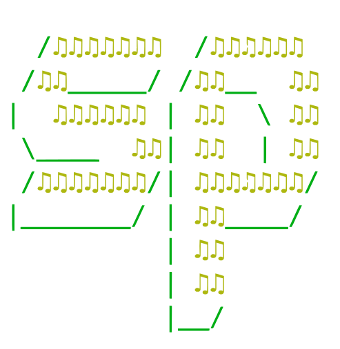

<div align="center">



**A fast, minimal Spotify CLI for your terminal**

[](https://github.com/matthew-collett/sp/releases)
[](go.mod)
[](LICENSE)

Control playback, search your library, manage devices, and save quick-play shortcuts — all without leaving the terminal.


</div>

## Installation

```sh
brew tap matthew-collett/sp
brew trust matthew-collett/sp
brew install sp
```

<details>
<summary>Install from source</summary>

```sh
git clone https://github.com/matthew-collett/sp
cd sp
make install
```

</details>

## Setup

`sp` uses the Spotify Web API and requires a developer application.

1. Create an app at the [Spotify Developer Dashboard](https://developer.spotify.com/dashboard)
2. Add `http://localhost:8080/callback` as a redirect URI
3. Copy your Client ID and Client Secret

```sh
sp configure   # enter your credentials
sp login       # authenticate via browser
```

## Usage Examples

### Playback

```sh
sp play                    # resume
sp play lofi               # play a shelf item by name
sp pause                   # pause
sp next                    # skip forward
sp previous                # skip back
sp volume 80               # set volume to 80%
sp volume up               # increase by 10
sp volume down 5           # decrease by 5
sp status                  # show current status
```

### Search

```sh
sp search tracks "dark side of the moon"
sp search albums "abbey road"
sp search tracks --mine    # search your saved tracks
sp search albums --mine    # browse your saved albums
sp search playlists --mine
```

### Shelf

Save any Spotify URI as a named shortcut and launch it instantly.

```sh
sp shelf add lofi spotify:playlist:37i9dQZF1DX3Ogo9pFvBkY
sp shelf                   # list all shortcuts
sp play lofi               # play by name
sp shelf drop lofi         # remove a shortcut
```

### Devices

```sh
sp devices                 # list available devices
sp activate "MacBook Pro"  # switch playback device
sp open                    # open Spotify on this device
```

## Contributing

See [CONTRIBUTING.md](CONTRIBUTING.md).

## License

[MIT](LICENSE)
